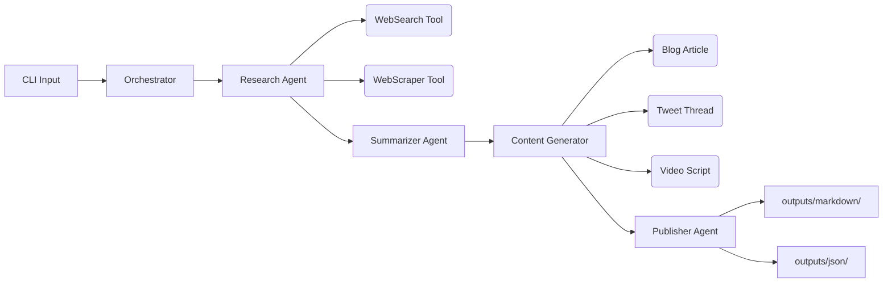
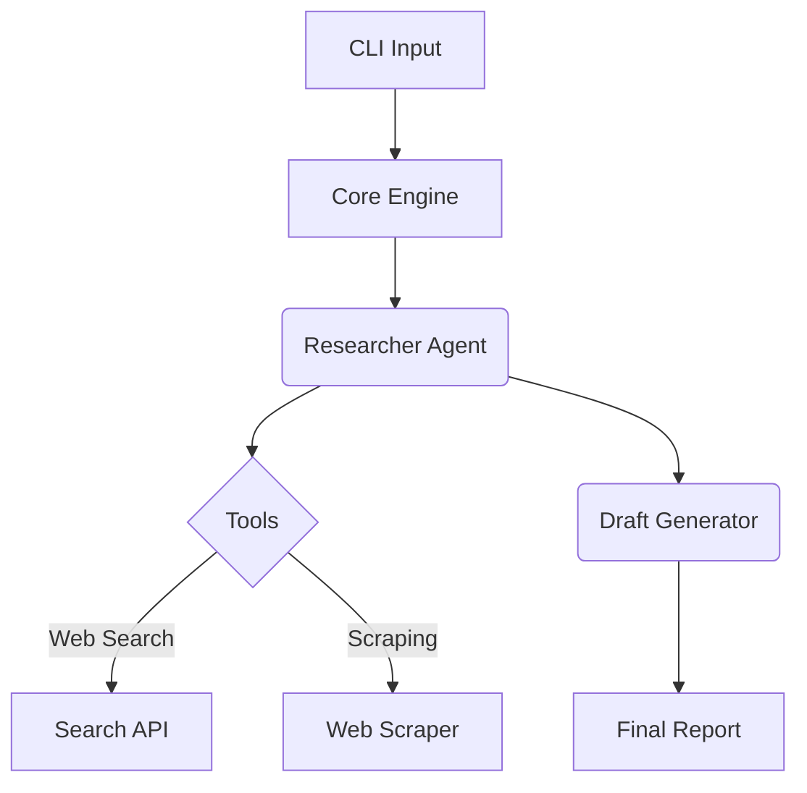

<<<<<<< HEAD
<div align="center">

# 🧠 AutoResearch Agent

### Enterprise-Grade Autonomous AI Research Framework

[](https://github.com/shenald-dev/autoresearch-agent/actions)
[](https://www.typescriptlang.org/)
[](LICENSE)
[](https://nodejs.org)

> Feed it a topic. Get a deep-dive research report, blog article, tweet thread, and video script — all from a single CLI command.

</div>

---

## ✨ Features

| Feature | Description |
|---------|-------------|
| 🔍 **Multi-Source Research** | Searches the web, scrapes content, and synthesizes findings from multiple sources |
| 📝 **Multi-Format Output** | Generates blog articles, tweet threads, and video scripts from research |
| 🧠 **LLM-Powered Analysis** | Uses LangChain LCEL pipelines for intelligent summarization and content creation |
| 🌐 **OpenRouter Support** | Free AI models via OpenRouter — no paid API key required |
| 🐳 **Docker Ready** | Full Docker + Docker Compose setup for isolated execution |
| 🧪 **Dry-Run Mode** | Validate your setup without spending API credits (`--dry-run`) |
| ⚡ **Type-Safe** | Built entirely in TypeScript with strict mode + Zod schemas |
| 🏗️ **Modular Agents** | Clean pipeline architecture — easily add new agents or tools |

---

## 🏗️ Architecture

AutoResearch uses a **4-agent pipeline** where each agent has a single responsibility:

```
┌──────────────┐     ┌──────────────┐     ┌──────────────┐     ┌──────────────┐
│   Research   │ ──▶ │  Summarizer  │ ──▶ │   Content    │ ──▶ │  Publisher   │
│    Agent     │     │    Agent     │     │  Generator   │     │    Agent     │
├──────────────┤     ├──────────────┤     ├──────────────┤     ├──────────────┤
│ • WebSearch  │     │ • LLM        │     │ • Blog       │     │ • Markdown   │
│ • WebScraper │     │ • Synthesis  │     │ • Tweets     │     │ • JSON       │
│              │     │              │     │ • Video      │     │              │
└──────────────┘     └──────────────┘     └──────────────┘     └──────────────┘
```



---

## 🚀 Quick Start

### Prerequisites

- **Node.js** 18+ ([download](https://nodejs.org))
- **API Key** — OpenRouter (free) or OpenAI

### Installation

```bash
# Clone the repository
git clone https://github.com/shenald-dev/autoresearch-agent.git
cd autoresearch-agent

# Install dependencies
npm install

# Set up environment
cp .env.example .env
# Edit .env and add your API key (see LLM Setup below)

# Build
npm run build
```

### Your First Research

```bash
# Basic research
npm start -- -t "The Future of AI Agents"

# With custom depth (more sources)
npm start -- -t "Quantum Computing" -d 8

# Dry run (test without using API credits)
npm start -- -t "Test Topic" --dry-run

# Use a specific model
npm start -- -t "Web Development Trends" -m "gpt-4"
```

---

## 🧠 LLM Setup

### Option A: OpenRouter (Free — Recommended)

1. Get a free API key at [openrouter.ai](https://openrouter.ai)
2. Add to your `.env` file:

```env
OPENROUTER_API_KEY=sk-or-v1-your-key-here
```

AutoResearch will automatically use `arcee-ai/trinity-large-preview:free` — a powerful free model.

### Option B: OpenAI (Paid)

```env
OPENAI_API_KEY=sk-your-openai-key-here
OPENAI_MODEL=gpt-4-turbo-preview
```

### Option C: Override at Runtime

```bash
npm start -- -t "Topic" -m "anthropic/claude-3-haiku"
```

---

## 📋 CLI Reference

```
Usage: autoresearch [options]

Options:
  -t, --topic <string>    The topic to research (required)
  -d, --depth <number>    Max sources to analyze, 1-10 (default: 5)
  -m, --model <string>    LLM model override
  --dry-run               Search only, skip LLM calls
  --no-publish            Print results to stdout, skip file output
  -V, --version           Output version number
  -h, --help              Display help
```

### Output Structure

```
outputs/
├── markdown/
│   ├── ai-agents-blog_2026-03-13.md      # Full blog article
│   └── ai-agents-report_2026-03-13.md    # Research report + tweets + script
└── json/
    ├── ai-agents-blog_2026-03-13.json    # Structured blog data
    └── ai-agents-report_2026-03-13.json  # Full research data
```

---

## 🐳 Docker

```bash
# Build the container
docker build -t autoresearch .

# Run a research task
docker run --rm --env-file .env \
  -v $(pwd)/outputs:/app/outputs \
  autoresearch -t "Artificial Intelligence" -d 5

# Or use Docker Compose
docker-compose run --rm agent -t "Machine Learning"
```

---

## 🧪 Testing

```bash
# Run all tests
npm test

# Run with coverage
npx jest --coverage

# Run specific test file
npx jest tests/tools.test.ts
```

---

## 🏗️ Extending

### Adding a New Agent

1. Create `src/agents/MyAgent.ts`:

```typescript
export class MyAgent {
    async execute(input: SummaryData): Promise<MyOutput> {
        // Your agent logic
    }
}
```

2. Wire it into `src/core/engine.ts`:

```typescript
const myAgent = new MyAgent(this.llm);
const myOutput = await myAgent.execute(summary);
```

### Adding a New Tool

Tools live in `src/tools/`. Create a new class with focused, reusable logic:

```typescript
export class MyTool {
    async run(input: string): Promise<string> {
        // Reusable utility logic
    }
}
```

---

## ⚠️ Troubleshooting

| Issue | Solution |
|-------|----------|
| `OPENROUTER_API_KEY not found` | Add your key to `.env` or export as environment variable |
| `SerpAPI unavailable` | Set `SERPAPI_KEY` in `.env`, or the agent uses intelligent mock data |
| `TypeError: fetch is not defined` | Upgrade to Node.js 18+ (native fetch required) |
| Docker build fails | Ensure Docker Desktop is running and Node 20 image is available |

---

## 📁 Project Structure

```
autoresearch-agent/
├── src/
│   ├── index.ts                  # CLI entry point
│   ├── core/
│   │   └── engine.ts             # Orchestrator (pipeline coordinator)
│   ├── agents/
│   │   ├── ResearchAgent.ts      # Web search + scraping
│   │   ├── SummarizerAgent.ts    # LLM summarization
│   │   ├── ContentGenerator.ts   # Blog/tweets/video generation
│   │   └── PublisherAgent.ts     # File output writer
│   └── tools/
│       ├── WebSearch.ts          # SerpAPI wrapper + mock fallback
│       ├── WebScraper.ts         # URL content extractor
│       └── FileWriter.ts         # Markdown/JSON file writer
├── tests/
│   ├── tools.test.ts             # Tool unit tests
│   └── agents.test.ts            # Agent + engine tests
├── .github/workflows/ci.yml     # CI pipeline
├── Dockerfile                    # Multi-stage Docker build
├── docker-compose.yml            # Container orchestration
├── ARCHITECTURE.md               # Detailed system design
└── CONTRIBUTING.md               # Contribution guidelines
```

---

## 🤝 Contributing

We welcome contributions! See [CONTRIBUTING.md](CONTRIBUTING.md) for guidelines.

- 🐛 **Found a bug?** Open an issue with steps to reproduce
- ✨ **Feature idea?** Open an issue to discuss before PR
- 🎨 **Docs improvement?** Always welcome

---

## 📄 License

MIT © [shenald-dev](https://github.com/shenald-dev)

---

<div align="center">
<sub>Built with intention by a Vibe Coder 🧘 • Focused on Flow</sub>
</div>
=======
# ✨ AutoResearch Agent

> An enterprise-grade, modular AI research agent built for high-performance content generation.

## Features
- **🧠 Modular Architecture**: Drop-in memory, tools, and output formatters.
- **⚡ Type-Safe**: Built entirely in TypeScript with strict schema validation (`zod`).
- **🔗 LangChain Core**: Powered by robust LCEL pipelines.
- **🌊 Zero Bloat**: Lightning-fast dev loop via `tsx` and `Biome`.

## Architecture Diagram


## Quick Start
```bash
npm install
npm run dev -- --topic "The Future of AI Agents"
```

*Built by a Vibe Coder. Focused on Flow.*
>>>>>>> e1d6a9b (perf(engine): optimize context string buffering (#32))
