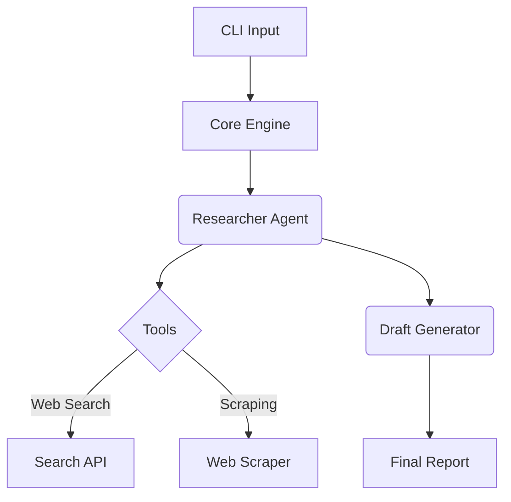

# ✨ AutoResearch Agent

> An enterprise-grade, modular AI research agent built for high-performance content generation.

## Features
- **🧠 Modular Architecture**: Drop-in memory, tools, and output formatters.
- **⚡ Type-Safe**: Built entirely in TypeScript with strict schema validation (`zod`).
- **🔗 LangChain Core**: Powered by robust LCEL pipelines.
- **🌊 Zero Bloat**: Lightning-fast dev loop via `tsx` and `Biome`.

## Architecture Diagram


## Quick Start
```bash
npm install
npm run dev -- --topic "The Future of AI Agents"
```

## 🤝 Contributing
Got a cool vibe or a brilliant optimization? We'd love your help! 💖
- 🐛 **Found a bug?** Open an issue to let us know.
- ✨ **Have a feature idea?** We are open to PRs! Just make sure to run `npm run lint` and keep the code pristine.
- 🎨 **Documentation tweaks?** Always welcome!

*Built by a Vibe Coder. Focused on Flow.*
