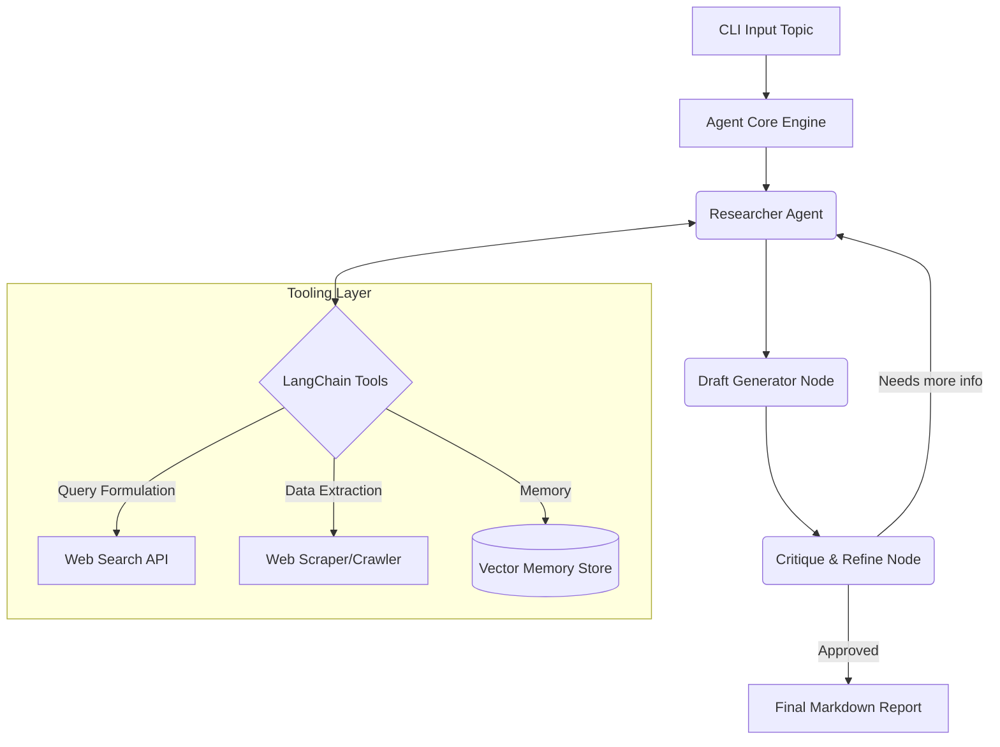

<div align="center">
  

  <h1>✨ AutoResearch Agent</h1>
  <p><b>Modular AI Research Agent</b></p>
  <i>An enterprise-grade, modular AI research agent built for high-performance content generation.</i>
  
  <br/>

  [](https://typescriptlang.org)
  [](https://langchain.com)
  [](LICENSE)
</div>

---

## 📑 Table of Contents
- [🌟 Overview](#-overview)
- [🚀 Enterprise Features](#-enterprise-features)
- [🗺️ System Architecture](#️-system-architecture)
- [⚡ Quick Start Guide](#-quick-start-guide)
- [💻 Comprehensive Usage](#-comprehensive-usage)
- [🤝 Contributing](#-contributing)

---

## 🌟 Overview

The **AutoResearch Agent** is an intelligent, high-performance CLI tool powered by LangChain and LLMs. It acts as an autonomous digital researcher that browses the internet, synthesizes data, cross-references sources, and generates deep-dive, impeccably formatted markdown reports on any given topic.

Say goodbye to having 50 browser tabs open. Let the agent do the heavy lifting while you focus on the insights.

---

## 🚀 Enterprise Features

- **🧠 Modular Architecture**: Built with a plug-and-play architecture supporting drop-in memory, custom tools, and varied output formatters.
- **⚡ Type-Safe & Robust**: Engineered entirely in TypeScript with strict schema validation via `zod` to prevent LLM hallucinations.
- **🔗 LangChain Core**: Powered by robust LCEL (LangChain Expression Language) pipelines for complex reasoning chains.
- **🕸️ Autonomous Web Browsing**: Natively hooks into search APIs to dynamically browse and scrape the web for the latest information.
- **🌊 Zero Bloat**: Lightning-fast developer loop via `tsx` and `Biome`, ensuring maximal performance.
- **📝 Automatic Markdown Compilation**: Synthesizes the raw data into gorgeous, structured markdown files instantly.

---

## 🗺️ System Architecture

The agent follows an iterative "Plan-and-Solve" pattern, dynamically deciding which tools to call based on the complexity of the research topic.


```mermaid
graph TD
    A[CLI Input Topic] --> B[Agent Core Engine]
    B --> C(Researcher Agent)
    
    subgraph Tooling Layer
        D{LangChain Tools}
        D -->|Query Formulation| E[Web Search API]
        D -->|Data Extraction| F[Web Scraper/Crawler]
        D -->|Memory| M[(Vector Memory Store)]
    end
    
    C <--> D
    C --> G(Draft Generator Node)
    G --> H(Critique & Refine Node)
    H -->|Needs more info| C
    H -->|Approved| I[Final Markdown Report]
```

---

## ⚡ Quick Start Guide

### 1. Prerequisites
Ensure you have Node.js 18+ and an API key for your preferred LLM (e.g., OpenAI, Anthropic).

### 2. Installation
Clone the repository and install the lightning-fast dependencies:
```bash
git clone https://github.com/shenald-dev/autoresearch-agent.git
cd autoresearch-agent
npm install
```

### 3. Configuration
Copy the sample environment file and add your API keys:
```bash
cp .env.example .env
```
Ensure you provide a valid `OPENAI_API_KEY` (or OpenRouter/Anthropic key) and a `TAVILY_API_KEY` (or equivalent) for web search.

---

## 💻 Comprehensive Usage

Run the agent dynamically using `tsx`:
```bash
npm run dev -- --topic "The Future of Autonomous AI Agents in 2026"
```

### Advanced Flags

- `--depth`: Control how deep the agent goes. `shallow` (default), `deep`, or `exhaustive`.
- `--output`: Specify a custom output directory (e.g., `./reports`).
- `--format`: Request specific formats like `markdown`, `json`, or `csv`.

**Example:**
```bash
npm run dev -- --topic "Quantum Computing Breakthroughs" --depth deep --output ./my-research
```

The agent will stream its thought process to the console, and upon completion, a highly detailed report will be saved to your output directory!

---

## 🤝 Contributing

We welcome all Vibe Coders to enhance the agent!

- 🐛 **Found a bug?** Open an issue to let us know.
- ✨ **New Tools?** If you have a great idea for a new LangChain tool, submit a PR!
- 🎨 **Documentation tweaks?** Always welcome!

---
> *Built by a Vibe Coder. Focused on Flow.*
